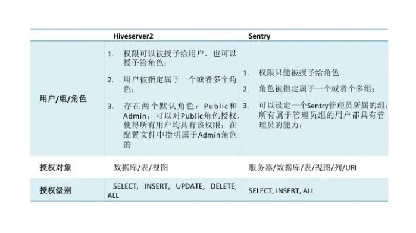
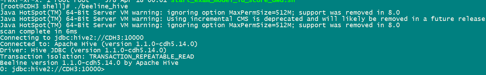

## hive通过Apache-Sentry授权

- [hive通过Apache-Sentry授权](#hive通过Apache-Sentry授权)
  - [一、Sentry 授权特点](#一sentry-授权特点)
  - [二、CDH Sentry 安装及配置](#二cdh-sentry-安装及配置)
    - [1、配置 Mysql 数据库](#配置-mysql-数据库)
    - [2、CDH中添加Sentry组件，gateway 选择全部节点。server选择主节点。](#2cdh中添加sentry组件gateway-选择全部节点server选择主节点)
    - [3、hive 配置中启用Sentry服务，关闭Hive的用户模拟功能，集群未启用安全认证环境下，需要配置以下参数](#3hive-配置中启用sentry服务关闭hive的用户模拟功能集群未启用安全认证环境下需要配置以下参数)
    - [4、impala配置中启动sentry](#4impala配置中启动sentry)
    - [5、Hue配置与Sentry集成](#hue配置与sentry集成)
    - [6、HDFS启用ACLS和Sentry权限同步](#6hdfs启用acls和sentry权限同步)
    - [7、回到Cloudera Manager主页，部署客户端配置并重启相关服务](#7回到cloudera-manager主页部署客户端配置并重启相关服务)
  - [三、Hive授权操作](#三hive授权操作)
    - [1、beeline连接](#1beeline连接)
    - [2、role角色](#2role角色)
    - [3、角色权限](#3角色权限)
    - [4、用户组](#4用户组)
    - [5、验证权限和查询自身权限](#5验证权限和查询自身权限)

#### 一、Sentry 授权特点

- Hive是早期将高级查询语言SQL引入Hadoop平台的引擎之一，早期的Hive服务器进程被称作Hiveserver1；Hiveserver1既不支持处理并行的多个连接，又不支持访问授权控制；后来这两个问题在Hiveserver2上被解决，Hiveserver2能够使用grant/revoke语句来限制用户对数据库、表、视图的访问权限，行列权限的控制是通过生成视图来实现的；但Hiveserver2的授权管理体系被认为存在问题，那就是任何通过认证登陆的用户都能够为自己增加对任何资源的访问权限。也就是说Hiveserver2提供的不是一种安全的授权体系，Hiveserver2的授权体系是为防止正常用户误操作而提供保障机制；不是为保护敏感数据的安全性而设计的。然而这些更多的是某些公司的说辞，事实上Hiveserver2自身的安全体系也在逐步完善，上述问题也在快速修复中。但授权管理其实不止是Hive需要，其他的查询引擎也迫切需要这些技术来完善和规范应用程序对数据的访问。对于细粒度授权管理的实现，很大一部分功能在各引擎之间是可以公用的，因此独立实现的授权管理工具是非常必要的。

- 在这样的背景下，Cloudera公司的一些开发者利用Hiveserver2中现有的授权管理模型，扩展并细化了很多细节，完成了一个相对具有使用价值的授权管理工具Sentry，下图是Sentry与Hiveserver2中的授权管理模型的对比：



#### 二、CDH Sentry 安装及配置

- ##### 1、配置 Mysql 数据库

```mysql
create database sentry  character set utf8;

grant all on sentry.* to 'sentry'@'%' identified by 'sentry';

flush privileges;
```

- ##### 2、CDH中添加Sentry组件，gateway 选择全部节点。server选择主节点。

安装完成后
如果缺少mysql driver
需要将mysql-connector 放入 sentry lib 目录下

```shell
cp /opt/cm-5.14.1/share/cmf/lib/mysql-connector-java-5.1.46-bin.jar /opt/cloudera/parcels/CDH/lib/sentry/lib
```

- ##### 3、hive 配置中启用Sentry服务，关闭Hive的用户模拟功能，集群未启用安全认证环境下，需要配置以下参数

在hive 组件配置中进行如下更改：

​	a、sentry-site.xml 的 Hive 服务高级配置代码段（安全阀）：

```xml
sentry-site.xml 的 Hive 服务高级配置代码段（安全阀）：
<property>    <name>sentry.hive.testing.mode</name>    <value>true</value></property>
```

​	b、Hive开启sentry服务


​	c、sentry.hive.server

``` xml
用于 Sentry 授权的服务器名称 hive.sentry.server：
<property>    <name>sentry.hive.server</name>    <value>server1</value></property>
```

​	d、hive-site.xml 的 Hive 客户端高级配置代码段（安全阀）

```xml
<property><name>hive.security.authorization.enabled</name><value>true</value></property><property><name>hive.security.authorization.createtable.owner.grants</name><value>ALL</value></property><property><name>hive.security.authorization.task.factory</name><value>org.apache.hadoop.hive.ql.parse.authorization.HiveAuthorizationTaskFactoryImpl</value></property>
```

​	e、禁用Hive Impersonation

取消勾选


​	f、启用数据库中的存储通知

勾选


- ##### 4、impala配置中启动sentry

在impala配置中更改


- ##### <u>5</u>、Hue配置与Sentry集成

在hue 配置中更改


- ##### 6、HDFS启用ACLS和Sentry权限同步

在HDFS 配置中更改


- ##### 7、回到Cloudera Manager主页，部署客户端配置并重启相关服务

#### 三、Hive授权操作

- ##### 1、beeline连接

```shell
beeline !connect jdbc:hive2://hostname:10000
#这时会让你输入用户名和密码，这里都输入hive

#sentry默认管理员是hive
#具有最大的权限；创建角色、授权等都要在这个角色下；
#如果想要增加管理员在sentry的sentry.service.admin.group配置项中增加；

#或者：
beeline -u jdbc:hive2://hostname:10000 -n hive -p hive
```

连接成功后：



- ##### 2、role角色

```mysql
# 创建role角色
create role admin;
create role select_mtdwstest;

# 删除角色
drop role select_mtdwstest;
```

- ##### 3、角色权限

```mysql
# 将server1 上的所有权限 赋予 admin 角色
grant all on server server1 to role admin;
# 将mtdwstest 数据库的 select 权限 赋予 select_mtdwstest 角色
grant select on database mtdwstest to role select_mtdwstest;

# 取消授权 此处用 revoke from
revoke insert on default from role select_ekwing_dataware;

# 查询角色授权
show grant role admin;
show grant role select_ekwing_dataware;
```

- ##### 4、用户组

```mysql
grant role admin to group hive;                   # hive用户组有admin权限

grant role select_mtdwstest to group zy;    	  # zy用户组有mtdwstest 数据库的查询权限
# 这里账号 zy，hive均为linux用户，在指定user使用beeline时，linux 系统必须要有对应的用户组，否则会报group not exists的错误，或者授权已经成功，但是权限不生效

# 取消组的授权
revoke role select_ekwing_dataware from group zy;

# 查询 用户组 的授权状况
SHOW ROLE GRANT GROUP hive;
SHOW ROLE GRANT GROUP zy;
```

- ##### 5、验证权限和查询自身权限

```mysql
# 登录zy 用户 ：beeline -u jdbc:hive2://cm3:10000 -n zy -p zy
show current roles ;  				  # 查询当前用户分配的权限
show grant role select_mtdwstest;       # 查询当前分配角色的授权情况,只能查看分配角色的权限

# 查看zy 用户是否有 mtdwstest 的select 权限
show databases;
+------------------+--+
|  database_name   |
+------------------+--+
| default          |
| ekwing_dataware  |
+------------------+--+
use mtdwstest;
show tables;

# 验证是否只有select 权限
create table test (id int ,name string );

Error: Error while compiling statement: FAILED: SemanticException No valid privileges
 User zy does not have privileges for CREATETABLE
 The required privileges: Server=server1->Db=ekwing_dataware->action=*; (state=42000,code=40000)
 
# 删除功能,报错
drop table test;

Error: Error while compiling statement: FAILED: SemanticException No valid privileges
 User zy does not have privileges for DROPTABLE
 The required privileges: Server=server1->Db=ekwing_dataware->Table=test->action=*; (state=42000,code=40000)

```

##### 


