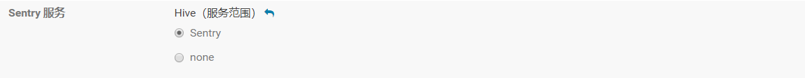
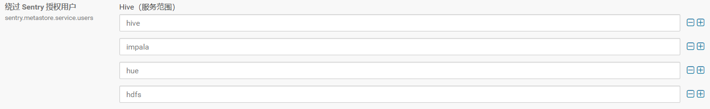
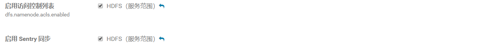

## hive通过Apache-Sentry授权

- [hive通过Apache-Sentry授权](#hive通过Apache-Sentry授权)
- [一、Sentry 授权特点](#一sentry-授权特点)
- [二、CDH Sentry 安装及配置](#二cdh-sentry-安装及配置)
  - [1、配置 Mysql 数据库](#配置-mysql-数据库)
  - [2、CDH中添加Sentry组件，gateway 选择全部节点。server选择主节点。](#2cdh中添加sentry组件gateway-选择全部节点server选择主节点)
  - [3、hive 配置中启用Sentry服务，关闭Hive的用户模拟功能，集群未启用安全认证环境下，需要配置以下参数](#3hive-配置中启用sentry服务关闭hive的用户模拟功能集群未启用安全认证环境下需要配置以下参数)
  - [4、impala配置中启动sentry](#4impala配置中启动sentry)
  - [5、Hue配置与Sentry集成](#hue配置与sentry集成)
  - [6、HDFS启用ACLS和Sentry权限同步](#6hdfs启用acls和sentry权限同步)
  - [7、回到Cloudera Manager主页，部署客户端配置并重启相关服务](#7回到cloudera-manager主页部署客户端配置并重启相关服务)
- [三、Hive授权操作](#三hive授权操作)

#### 一、Sentry 授权特点

1. hive 自带授权方式，任意用户（可以在hive cli 创建linux 用户 或者在 beeline 输入虚拟用户，）拥有可以给自己赋最高权 的能力 ，hive CLI 和HiveServer2 权限一致，只需在一处进行设置
2. Sentry 授权方式，只对 hiveServer2 生效，只有部分指定用户拥有 授权和解除权限 能力， 普通部分权限用户只能查看自己的角色和权限。在beeline 登录hive 用户（hive 用户在hive 配置用设置为绕过Sentry 授权用户），进行授权，hive cli 与beeline 授权不共用 ，而且授权sql 语法不同。
3. hive cli 还是用的hive S自带的S授权方式，且会有问题（比如hive CLI 授权 root 拥有全部权限，但是root 在查询 一张表时，这张表的HDFS 数据 为hive 用户的 就会查询失败）

#### 二、CDH Sentry 安装及配置

- ##### 1、配置 Mysql 数据库

```mysql
create database sentry  character set utf8;

grant all on sentry.* to 'sentry'@'%' identified by 'sentry';

flush privileges;
```

- ##### 2、CDH中添加Sentry组件，gateway 选择全部节点。server选择主节点。

安装完成后
如果缺少mysql driver
需要将mysql-connector 放入 sentry lib 目录下

```shell
cp /opt/cm-5.14.1/share/cmf/lib/mysql-connector-java-5.1.46-bin.jar /opt/cloudera/parcels/CDH/lib/sentry/lib
```

- ##### 3、hive 配置中启用Sentry服务，关闭Hive的用户模拟功能，集群未启用安全认证环境下，需要配置以下参数

在hive 组件配置中进行如下更改：

​	a、sentry-site.xml 的 Hive 服务高级配置代码段（安全阀）：

```xml
sentry-site.xml 的 Hive 服务高级配置代码段（安全阀）：
<property>    <name>sentry.hive.testing.mode</name>    <value>true</value></property>
```

​	b、Hive开启sentry服务



​	c、sentry.hive.server

``` xml
用于 Sentry 授权的服务器名称 hive.sentry.server：
<property>    <name>sentry.hive.server</name>    <value>server1</value></property>
```

​	d、hive-site.xml 的 Hive 客户端高级配置代码段（安全阀）

```xml
<property><name>hive.security.authorization.enabled</name><value>true</value></property><property><name>hive.security.authorization.createtable.owner.grants</name><value>ALL</value></property><property><name>hive.security.authorization.task.factory</name><value>org.apache.hadoop.hive.ql.parse.authorization.HiveAuthorizationTaskFactoryImpl</value></property>
```

​	e、绕过 Sentry 授权用户（sentry.metastore.service.users）

配置中的用户可以进行创建角色和授权行为， 其他用户不可



​	f、禁用Hive Impersonation

取消勾选


​	g、启用数据库中的存储通知

勾选


- ##### 4、impala配置中启动sentry

在impala配置中更改


- ##### 5、Hue配置与Sentry集成

在hue 配置中更改


- ##### 6、HDFS启用ACLS和Sentry权限同步

在HDFS 配置中更改



- ##### 7、回到Cloudera Manager主页，部署客户端配置并重启相关服务

#### 三、Hive授权操作
